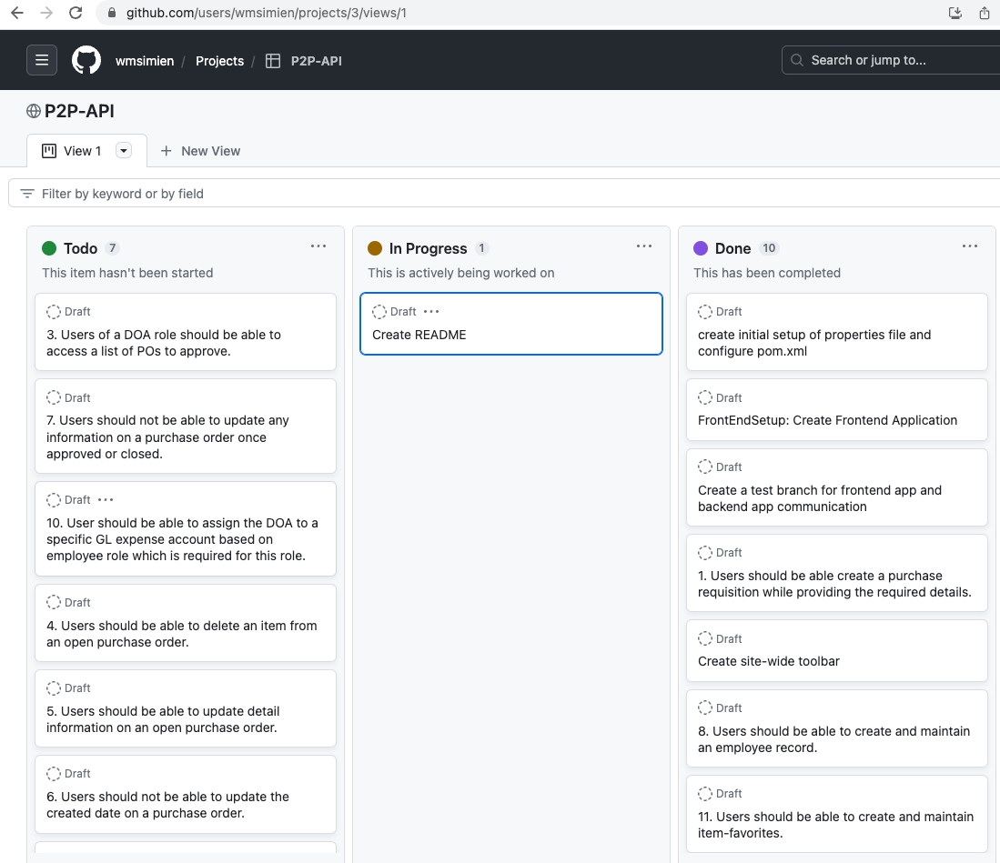
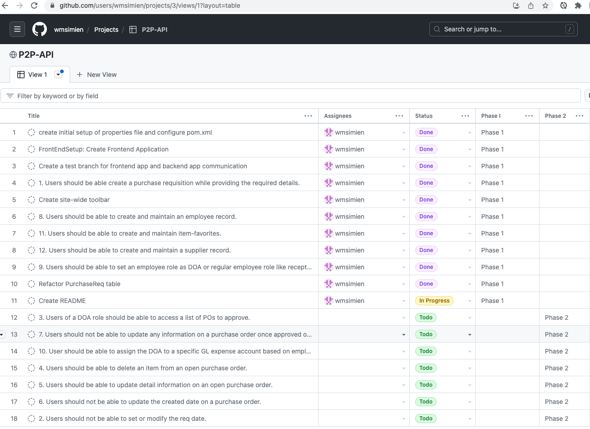
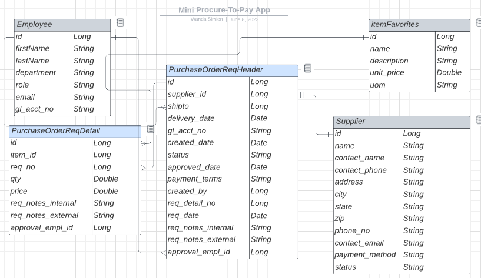

# Mini-Procure To Pay
[](https://opensource.org/licenses/MIT)

## Description
A Client requested an application which will provide their buyers the flexibility to create a purchase requisition for indirect goods and services like marketing, media and advertising services or travel, entertainment, or facilities services and turning that request into a purchase order. With more and more of their suppliers requesting cash on delivery, our client is researching ways of streamlining their process of making indirect purchases while maintaining some efficiencies and accountability in their accounts payable process.  With a COD payment terms, the client can pay their suppliers online at the time goods and services are delivered.


# Table of Contents
- [Project Planning](#project-planning)
- [User Stories](#user-stories)
- [Technologies Used](#technologies-used)
- [Installation](#installation)
- [Usage](#usage)
- [Questions](#questions)
- [Credits](#credits)
- [Contributing](#contributing)

## Project Planning
GitHub Projects was instrumental in keeping on track and focused on the many tasks to complete and/or rethink for the project. During the brainstorm exercise, an ERD and wire-frame was created based on the user stories provided by the client.  After meeting with the client to go over those artifacts and obtain sign-off, each user story would become a task/todo within the project tool.  




A decision was made to break the project up into phrases for the backend application (API) and the frontend application (Client), as well.  There would be a combination of the API and Client applications in each phase.  The first phase for the API would be creating the models, controllers, repositories, test, and endpoints.

| Request Type | URL                        | Functionality              |  
|--------------|----------------------------|----------------------------|
| GET          | api/employee/              | Get all employees          |
| GET          | api/employee/{employeeId}/ | Get a specific employee    |
| POST         | api/employee/              | Create an employee         |  
| PUT          | api/employee/{employeeId}/ | Update a specific employee |   


| Request Type | URL                        | Functionality              |  
|--------------|----------------------------|----------------------------|
| GET          | api/suppliers/             | Get all suppliers          |
| GET          | api/suppliers/{supplierId}/ | Get a specific supplier    |
| POST         | api/suppliers/             | Create a supplier          |
| PUT          | api/suppliers/{supplierId} | Update a specific supplier |
| DELETE       | api/suppliers/{supplierId} | Delete a specific supplier |

| Request Type | URL                 | Functionality                   |  
|--------------|---------------------|---------------------------------|
| GET          | api/items/          | Get all item favorites          |
| GET          | api/items/{itemId}/ | Get an item favorite            |
| POST         | api/items/          | Create an item favorite         |
| PUT          | api/items/{itemId}/ | Update an item favorite         |
| DELETE       | api/items/{itemId}/ | Delete a specific item favorite |

| Request Type | URL         | Functionality |  
|--------------|-------------|---------------|
| GET          | api/po-req/ | Get all reqs  |


## User Stories

1. Users should be able to create and maintain an employee record.
2. Users should be able to set an employee role as DOA or regular employee role like a Buyer. 
2. User should be able to assign the DOA (delegation of authority) to a specific GL (General Ledger) expense account based on employee role which is required for this role.
3. Users should be able to create and maintain a supplier record.
4. Users should be able to create and maintain an item-favorites record.
3. Users should be able to see a listing of all purchase order requisitions.

## Usage

Using an API platform like Postman, you can access all operational endpoints of the Procure-To-Pay application which are available on port 8080.  For now, the H2 in memory database was chosen for this proof of concept; however, the endpoints will be consumed by a client application.


An unregistered user can only access the register endpoint as follows:
### #2 To Create a New User (Register):
```
localhost:9092/auth/users/register/

{
    "userName" : "jane",
    "email": "jane@aol.com",
    "password": "jane"
}
```
A registered user can accessc the login endpoint as follows:
### #3 To Login As a Registered User:
```
localhost:9092/auth/users/login/

{
    "email":"jane@aol.com",
    "password":"jane"
}
```

Once the registered user logs in, a JWT will be returned which will be needed to access all the other endpoints.  The JWT will need to be added to every request/endpoint headers section with 'Authorization' as a Key and the Value will need to be Bear [JWT] as follows:


### #4 Create A Beverage Type
```
POST localhost:9092/api/beverage-type/
{
    "name":"MaeMae-Tea Drinks"
    
}

RESPONSE 200 OK
{
    "id": 29,
    "name": "MaeMae-Tea Drinks",
    "beverageList": null
}
```

### #5 Listing of All Beverage Types
```
GET localhost:9092/api/beverage-type/

RESPONSE 200 OK
[
    {
        "id": 29,
        "name": "MaeMae-Tea Drinks",
        "beverageList": []
    }
]
```

### #6 Update A Specific Beverage Type
```
PUT localhost:9092/api/beverage-type/29/
{
    "name":"MaeMae - Very Cherry Drinks"
}

RESPONSE 200 OK
{
    "id": 29,
    "name": "MaeMae - Very Cherry Drinks",
    "beverageList": []
}
```
### #8 Create A Beverage For A Specific Beverage Type
```
POST localhost:9092/api/beverage-type/29/
{
    "name":"MaeMae - Cherry-Berry Drink",
    "description":"Sweet Smooth Cherry Berry Fizzles",
    "pairing":"Tofu/Chicken/Fish",
    "goodToKnow":"Great w/ all eats.",
    "proTip":"Enjoy w/ all eats"
}

RESPONSE 200 OK
{
    "id": 30,
    "name": "MaeMae - Cherry-Berry Drink",
    "description": "Sweet Smooth Cherry Berry Fizzles",
    "pairing": "Tofu/Chicken/Fish",
    "goodToKnow": "Great w/ all eats.",
    "proTip": "Enjoy w/ all eats"
}
```

### #11 Display A Listing Of All Beverage
```
GET localhost:9092/api/beverages/

RESPONSE 200 OK
[
    {
        "id": 12,
        "name": "Java Twins",
        "description": "Smooth Twin Java",
        "pairing": "Tofu/Chicken/Fish",
        "goodToKnow": "Great w/ all eats.",
        "proTip": "Enjoy w/ all eats"
    },
    {
        "id": 13,
        "name": "Java Blend",
        "description": "Smooth Blended Java",
        "pairing": "Tofu/Chicken/Fish",
        "goodToKnow": "Great w/ all eats.",
        "proTip": "Enjoy w/ all eats"
    },
    {
        "id": 29,
        "name": "Java Blend",
        "description": "Smooth Blended Java",
        "pairing": "Tofu/Chicken/Fish",
        "goodToKnow": "Great w/ all eats.",
        "proTip": "Enjoy w/ all eats"
    },
    {
        "id": 30,
        "name": "MaeMae - Cherry-Berry Drink",
        "description": "Sweet Smooth Cherry Berry Fizzles",
        "pairing": "Tofu/Chicken/Fish",
        "goodToKnow": "Great w/ all eats.",
        "proTip": "Enjoy w/ all eats"
    }
]
```

5.    Users should be able to create a purchase requisition while providing the required details.
6.  Users of a DOA role should be able to access a list of POs to approve.
3. Users should be able to delete an item from an open purchase order. Users should be able to update detail information on an open purchase order. Users should not be able to update the created date on a purchase order. Users should not be able to update any information on a purchase order once approved or closed.

## Technologies Used

- Java 17
- Spring Boot 2.7.8
- H2 Database
- MockMvc
- Lucidchart

## Installation

1.  Clone the repository.
1.  Ensure you are using JDK 17, Spring Boot 2.7.8 and Maven 4.x
1.  Using IntelliJ IDEA, open the pom.xml and ensure all necessary dependencies have been installed.
1.  To run the project, navigate to the Procure2payApplication under /src/main/java/com.avery.procure2pay and right-click the file and choose run Procure2payApplication from the popup menu.  Or you can double-click on the file to open it and click the 'Run' option (green caret).
1.  Once the application is running you should see something like this:
```
   2023-04-30 12:48:03.906  INFO 71465 --- [           main] o.apache.catalina.core.StandardService   : Starting service [Tomcat]
   2023-04-30 12:48:03.906  INFO 71465 --- [           main] org.apache.catalina.core.StandardEngine  : Starting Servlet engine: [Apache Tomcat/9.0.71]
   2023-04-30 12:48:03.940  INFO 71465 --- [           main] o.a.c.c.C.[Tomcat].[localhost].[/]       : Initializing Spring embedded WebApplicationContext
   ```

https://github.com/users/wmsimien/projects/2
## Credits

My tech gains are due to the outstanding instructors involved with the 13-week Full-Stack Immersive.  For the many people praying and supporting me from the start and through to the end, whenever that may come.  For all, and I mean all, of my classmates in this cohort, I appreciate working with and learning from you all.  I am thankful for you all.

## Contributing

There are no current 'unsolved' issues; however,  any contributing suggestion(s) or bug notification(s) is greatly appreciated.  Reporting
any bug can be submitted via email, see Questions section below for contact information.  
Please put [Bug Report] in the subject section of the email.  Within the email, please
provide details of the bug(s) being reported.  All email correspondences will be replied
back to within a timely manner.  For feature suggestions, please fork the repo and create
a pull request.  Thanks.

1.  Fork the project/repo into your own GitHub account and create a local clone.
1.  Create your feature branch (git checkout -b yourfeaturefolder/YourFeaturName)
1.  Commit your changes (git commit -m 'Add your comment here regarding your feature).
1.  Push to the branch (git push origin yourfeaturefolder/YourFeaturName).
1.  Open a pull request, which will be responded to in a timely manner.

## License

[MIT License](https://opensource.org/licenses/MIT) A short and simple permissive license with conditions only requiring preservation of
copyright and license notices. Licensed works, modifications, and larger works may be distributed under different
terms and without source code.

## Questions

Send all questions/comments to:
| GitHub: wmsimien https://github.com/wmsimien                                  
|--------------------------------------------------------------------------------
| Email:  wanda.avery@att.net

## Test

Testing of this application is a success when you are able to successfully access all endpoints as a registered user of FTBAPI after having completed the installation steps successfully.  I hope you enjoy the Family Time Beverage API.
